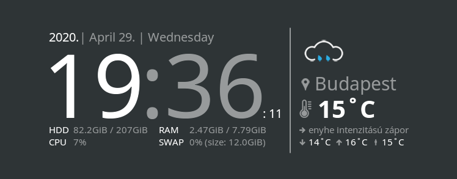
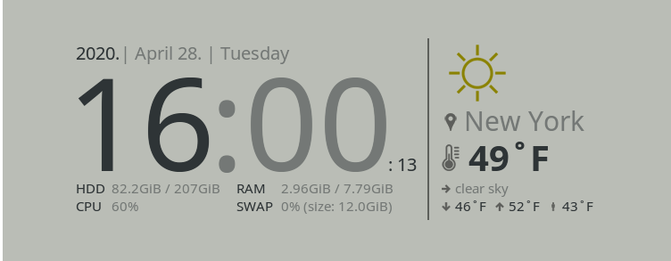
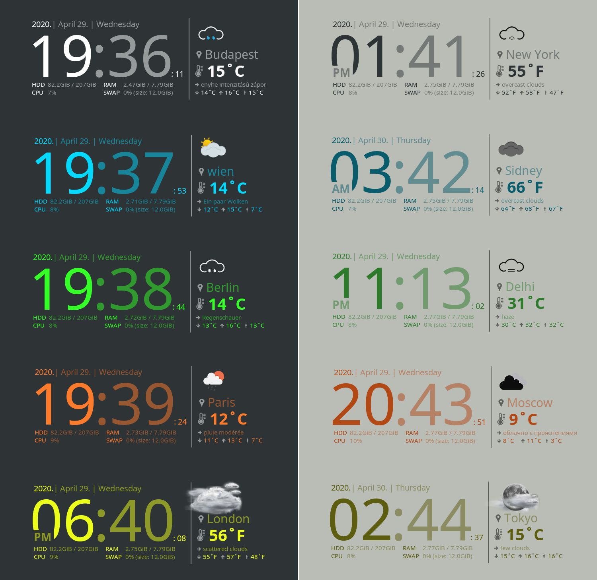
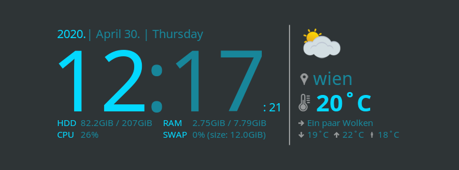
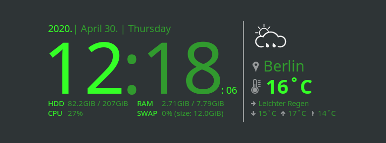
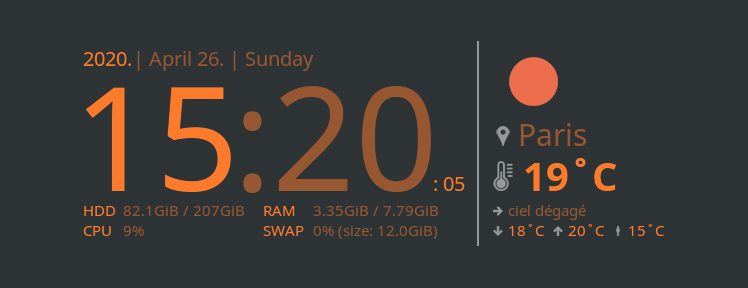
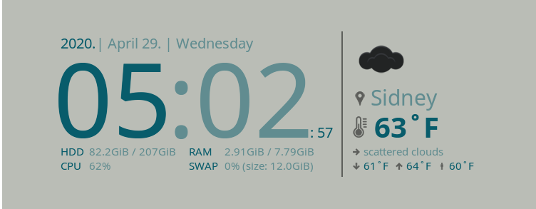
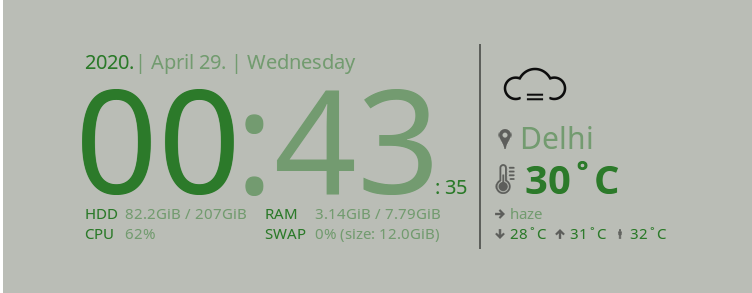
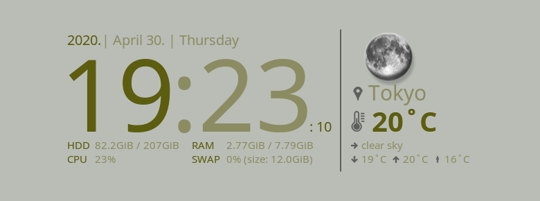

# Conky Widget with Clock and Weather

- This widget uses [openweathermap.org](https://openweathermap.org) API, to get weather information.
- Easy to customize, supports **light** and **dark appearance**. *(See: [Example Themes](#example-themes))*.
- Supports `12` and `24-hour` clock format.

<table>
    <tr>
        <th>
            Dark theme
        </th>
        <th>
            Light theme
        </th>
    </tr>
    <tr>
        <td>
            
        </td>
        <td>
            
        </td>
    </tr>
</table>

## Table of Contents

* [Installation](#installation)
   * [1. Install conky and other dependencies](#1-install-conky-and-other-dependencies)
      * [On Debian based systems](#on-debian-based-systems)
      * [On CentOS](#on-centos)
      * [On ArchLinux](#on-archlinux)
      * [On SuseLinux](#on-suselinux)
      * [On Mac](#on-mac)
   * [2. Clone repository](#2-clone-repository)
   * [3. Install font](#3-install-font)
* [First setup](#first-setup)
   * [1. Get OpenWeatherMap API key](#1-get-openweathermap-api-key)
   * [2. Change your settings](#2-change-your-settings)
* [Start / stop the widget](#start--stop-the-widget)
   * [1. Start the widget](#1-start-the-widget)
   * [2. Stop the widget](#2-stop-the-widget)
* [Configuration](#configuration)
   * [The app.cfg](#the-appcfg)
   * [The settings.lua](#the-settingslua)
      * [Sections](#sections)
* [Example Themes](#example-themes)
   * [Budapest](#budapest)
   * [Wien](#wien)
   * [Berlin](#berlin)
   * [Paris](#paris)
   * [London](#london)
   * [New York](#new-york)
   * [Sidney](#sidney)
   * [Delhi](#delhi)
   * [Moscow](#moscow)
   * [Tokyo](#tokyo)
* [Convert images to dark](#convert-images-to-dark)
   * [Install imagemagic](#install-imagemagic)
   * [Run the command](#run-the-command)

## Installation

### 1. Install conky and other dependencies

#### On Debian based systems

```bash
sudo apt update
sudo apt install conky-all curl git
conky --version
```

[Back to top](#conky-widget-with-clock-and-weather)

#### On CentOS

```bash
sudo yum install -y epel-release
sudo yum install -y conky curl git
```

[Back to top](#conky-widget-with-clock-and-weather)

#### On ArchLinux

```bash
sudo pacman -Sy --noconfirm conky curl git
```

[Back to top](#conky-widget-with-clock-and-weather)

#### On SuseLinux

```bash
sudo zypper -n in conky curl git
```

[Back to top](#conky-widget-with-clock-and-weather)

#### On Mac

You can find the installation steps on [this page](https://github.com/Conky-for-macOS/conky-for-macOS/wiki/How-to-install).

[Back to top](#conky-widget-with-clock-and-weather)

### 2. Clone repository

```bash
git clone https://github.com/takattila/Clock-With-Weather-Conky.git ~/.conky/Clock-With-Weather-Conky
```

[Back to top](#conky-widget-with-clock-and-weather)

### 3. Install font

If you don't have `Noto Sans Regular` font *(usually on Ubuntu)* 
you can install it as the followings:
  ```bash
  mkdir -p ~/.local/share/fonts
  cp ~/.conky/Clock-With-Weather-Conky/fonts/NotoSans-Regular.ttf ~/.local/share/fonts
  ls ~/.local/share/fonts
  ```

[Back to top](#conky-widget-with-clock-and-weather)

## First setup

### 1. Get OpenWeatherMap API key

- Go to [openweathermap.org/users/sign_up](https://home.openweathermap.org/users/sign_up) and create your account.
- After the registration, you should receive your API key **via e-mail**.

[Back to top](#conky-widget-with-clock-and-weather)

### 2. Change your settings

- Edit the [~/.conky/Clock-With-Weather-Conky/settings.lua](settings.lua) file.
- First, you should change the [settings.weather](https://github.com/takattila/Clock-With-Weather-Conky/blob/master/settings.lua#L16) section, as required:
  ```bash
  city = "Budapest",    # Where you are right now?
  language_code = "hu", # Check it here: https://openweathermap.org/current#multi
  lang = "hu",          # Check it here: https://openweathermap.org/current#multi
  units = "metric",     # Units: metric, imperial.
  ```

[Back to top](#conky-widget-with-clock-and-weather)

## Start / stop the widget

### 1. Start the widget

```bash
bash ~/.conky/Clock-With-Weather-Conky/start.sh <YOUR-API-KEY>
```

[Back to top](#conky-widget-with-clock-and-weather)

### 2. Stop the widget

```bash
bash ~/.conky/Clock-With-Weather-Conky/stop.sh
```

[Back to top](#conky-widget-with-clock-and-weather)

## Configuration

### The app.cfg

Here we can modify the conky window settings:

- [Background](app.cfg#L2)
- [Border](app.cfg#L34)
- [Size](app.cfg#L24-L25)
- [Alignment](app.cfg#L27)

### The settings.lua

Here we can change the display settings, such as:

- [Theme, iconset, text, color](settings.lua#L3-L23)
- [System](settings.lua#L25-L27)
- [Weather settings](settings.lua#L29-L36)

[Back to top](#conky-widget-with-clock-and-weather)

## Example Themes



[Back to top](#conky-widget-with-clock-and-weather)

### Budapest


`settings.lua`:

```lua
local settings = {}

settings.appearance = {
    theme = "light",
    icon = {
        set = "dovora",
        transparency = 1.0,
    },
    font = {
        face = "Noto Sans",
        color = "#ffffff",
        transparency = {
            max = 1.0,
            min = 0.5,
        },
    },
    background = {
        transparency = 0.0,
        color = "#000000",
    },
}

settings.system = {
    locale = "en_US.UTF-8",
    hour_format_12 = false,
}

settings.weather = {
    city = "Budapest",
    language_code = "hu",
    lang = "hu",
    units = "metric",
    api_key = os.getenv("OPENWEATHER_API_KEY"),
    api_url = "https://api.openweathermap.org/data/2.5/weather",
}

return settings
```

[Back to top](#conky-widget-with-clock-and-weather)

### Wien



`settings.lua`:

```lua
local settings = {}

settings.appearance = {
    theme = "light",
    icon = {
        set = "modern",
        transparency = 1.0,
    },
    font = {
        face = "Noto Sans",
        color = "#03d8fe",
        transparency = {
            max = 1.0,
            min = 0.5,
        },
    },
    background = {
        transparency = 0.0,
        color = "#000000",
    },
}

settings.system = {
    locale = "en_US.UTF-8",
    hour_format_12 = false,
}

settings.weather = {
    city = "wien",
    language_code = "at",
    lang = "de",
    units = "metric",
    api_key = os.getenv("OPENWEATHER_API_KEY"),
    api_url = "https://api.openweathermap.org/data/2.5/weather",
}

return settings
```

[Back to top](#conky-widget-with-clock-and-weather)

### Berlin



`settings.lua`:

```lua
local settings = {}

settings.appearance = {
    theme = "light",
    icon = {
        set = "monochrome",
        transparency = 1.0,
    },
    font = {
        face = "Noto Sans",
        color = "#34ff26",
        transparency = {
            max = 1.0,
            min = 0.5,
        },
    },
    background = {
        transparency = 0.0,
        color = "#000000",
    },
}

settings.system = {
    locale = "en_US.UTF-8",
    hour_format_12 = false,
}

settings.weather = {
    city = "Berlin",
    language_code = "de",
    lang = "de",
    units = "metric",
    api_key = os.getenv("OPENWEATHER_API_KEY"),
    api_url = "https://api.openweathermap.org/data/2.5/weather",
}

return settings
```

[Back to top](#conky-widget-with-clock-and-weather)

### Paris



`settings.lua`:

```lua
local settings = {}

settings.appearance = {
    theme = "light",
    icon = {
        set = "openweathermap",
        transparency = 1.0,
    },
    font = {
        face = "Noto Sans",
        color = "#ff7b2c",
        transparency = {
            max = 1.0,
            min = 0.5,
        },
    },
    background = {
        transparency = 0.0,
        color = "#000000",
    },
}

settings.system = {
    locale = "en_US.UTF-8",
    hour_format_12 = false,
}

settings.weather = {
    city = "Paris",
    language_code = "fr",
    lang = "fr",
    units = "metric",
    api_key = os.getenv("OPENWEATHER_API_KEY"),
    api_url = "https://api.openweathermap.org/data/2.5/weather",
}

return settings
```

[Back to top](#conky-widget-with-clock-and-weather)

### London


`settings.lua`:

```lua
local settings = {}

settings.appearance = {
    theme = "light",
    icon = {
        set = "vclouds",
        transparency = 1.0,
    },
    font = {
        face = "Noto Sans",
        color = "#ecff18",
        transparency = {
            max = 1.0,
            min = 0.5,
        },
    },
    background = {
        transparency = 0.0,
        color = "#000000",
    },
}

settings.system = {
    locale = "en_US.UTF-8",
    hour_format_12 = true,
}

settings.weather = {
    city = "London",
    language_code = "gb",
    lang = "gb",
    units = "imperial",
    api_key = os.getenv("OPENWEATHER_API_KEY"),
    api_url = "https://api.openweathermap.org/data/2.5/weather",
}

return settings
```

[Back to top](#conky-widget-with-clock-and-weather)

### New York


`settings.lua`:

```lua
local settings = {}

settings.appearance = {
    theme = "dark",
    icon = {
        set = "dovora",
        transparency = 1.0,
    },
    font = {
        face = "Noto Sans",
        color = "#2e3436",
        transparency = {
            max = 1.0,
            min = 0.5,
        },
    },
    background = {
        transparency = 0.0,
        color = "#000000",
    },
}

settings.system = {
    locale = "en_US.UTF-8",
    hour_format_12 = true,
}

settings.weather = {
    city = "New York",
    language_code = "us",
    lang = "us",
    units = "imperial",
    api_key = os.getenv("OPENWEATHER_API_KEY"),
    api_url = "https://api.openweathermap.org/data/2.5/weather",
}

return settings
```

[Back to top](#conky-widget-with-clock-and-weather)

### Sidney



`settings.lua`:

```lua
local settings = {}

settings.appearance = {
    theme = "dark",
    icon = {
        set = "modern",
        transparency = 1.0,
    },
    font = {
        face = "Noto Sans",
        color = "#085c6b",
        transparency = {
            max = 1.0,
            min = 0.5,
        },
    },
    background = {
        transparency = 0.0,
        color = "#000000",
    },
}

settings.system = {
    locale = "en_US.UTF-8",
    hour_format_12 = true,
}

settings.weather = {
    city = "Sidney",
    language_code = "au",
    lang = "au",
    units = "imperial",
    api_key = os.getenv("OPENWEATHER_API_KEY"),
    api_url = "https://api.openweathermap.org/data/2.5/weather",
}

return settings
```

[Back to top](#conky-widget-with-clock-and-weather)

### Delhi



`settings.lua`:

```lua
local settings = {}

settings.appearance = {
    theme = "dark",
    icon = {
        set = "monochrome",
        transparency = 1.0,
    },
    font = {
        face = "Noto Sans",
        color = "#2c7a2a",
        transparency = {
            max = 1.0,
            min = 0.5,
        },
    },
    background = {
        transparency = 0.0,
        color = "#000000",
    },
}

settings.system = {
    locale = "en_US.UTF-8",
    hour_format_12 = true,
}

settings.weather = {
    city = "Delhi",
    language_code = "in",
    lang = "in",
    units = "metric",
    api_key = os.getenv("OPENWEATHER_API_KEY"),
    api_url = "https://api.openweathermap.org/data/2.5/weather",
}

return settings
```

[Back to top](#conky-widget-with-clock-and-weather)

### Moscow


`settings.lua`:

```lua
local settings = {}

settings.appearance = {
    theme = "dark",
    icon = {
        set = "openweathermap",
        transparency = 1.0,
    },
    font = {
        face = "Noto Sans",
        color = "#b24814",
        transparency = {
            max = 1.0,
            min = 0.5,
        },
    },
    background = {
        transparency = 0.0,
        color = "#000000",
    },
}

settings.system = {
    locale = "en_US.UTF-8",
    hour_format_12 = false,
}

settings.weather = {
    city = "Moscow",
    language_code = "ru",
    lang = "ru",
    units = "metric",
    api_key = os.getenv("OPENWEATHER_API_KEY"),
    api_url = "https://api.openweathermap.org/data/2.5/weather",
}

return settings
```

[Back to top](#conky-widget-with-clock-and-weather)

### Tokyo



`settings.lua`:

```lua
local settings = {}

settings.appearance = {
    theme = "dark",
    icon = {
        set = "vclouds",
        transparency = 1.0,
    },
    font = {
        face = "Noto Sans",
        color = "#5c5d0f",
        transparency = {
            max = 1.0,
            min = 0.5,
        },
    },
    background = {
        transparency = 0.0,
        color = "#000000",
    },
}

settings.system = {
    locale = "en_US.UTF-8",
    hour_format_12 = false,
}

settings.weather = {
    city = "Tokyo",
    language_code = "jp",
    lang = "jp",
    units = "metric",
    api_key = os.getenv("OPENWEATHER_API_KEY"),
    api_url = "https://api.openweathermap.org/data/2.5/weather",
}

return settings
```

[Back to top](#conky-widget-with-clock-and-weather)

## Convert images to dark

If you want to add your custom weather icons, you can put them under `images/theme/light/weather/` directory.
After that, you can convert these icons to dark by `imagemagic` tool.

### Install imagemagic

You can download binaries from [here](https://www.imagemagick.org/script/download.php#unix).

[Back to top](#conky-widget-with-clock-and-weather)

### Run the command

```bash
cd ~/.conky/Clock-With-Weather-Conky

image_dir="monochrome"
light_dir="images/theme/light/weather/${image_dir}"
dark_dir="images/theme/dark/weather/${image_dir}"

mkdir -p $dark_dir

for f in $(ls $light_dir) ; do
    convert "${light_dir}/${f}" \
        -colorspace HSI \
        -channel B \
        -level 100,0% +channel \
        -colorspace sRGB \
    "${dark_dir}/${f}"
done
```

[Back to top](#conky-widget-with-clock-and-weather)
