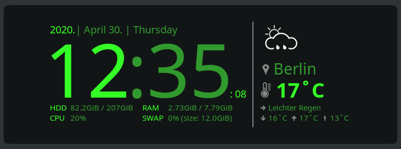
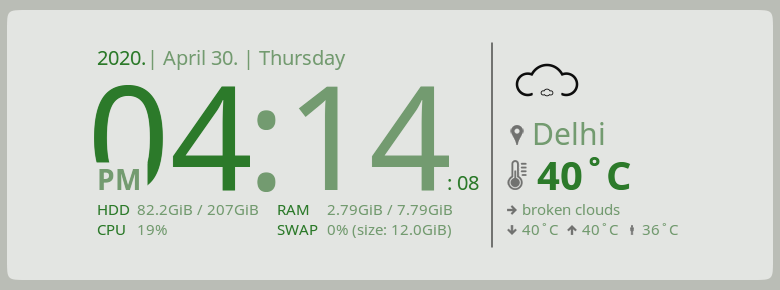

# Conky Widget with Clock and Weather

- This widget uses [openweathermap.org](https://openweathermap.org) API, to get weather information.
- Easy to customize, supports appearance on **light** and **dark** backgrounds. *(See: [Example Themes](#example-themes))*.
- Supports `12` and `24-hour` clock format.

<table>
    <tr>
        <th>
            On a dark background
        </th>
        <th>
            On a light background
        </th>
    </tr>
    <tr>
        <td>
            
        </td>
        <td>
            
        </td>
    </tr>
</table>


## Get the OpenWeatherMap API key

- Go to the [openweathermap.org/users/sign_up](https://home.openweathermap.org/users/sign_up) page and create your account.
- After the registration, you should receive your API key **via e-mail**.
- For easier installation, export this API key before running the script below:

  ```bash
  export OPENWEATHER_API_KEY=<YOUR-API-KEY>
  ```

[Back to top](#conky-widget-with-clock-and-weather)

## Installation

You can install it via the command-line with either `wget` or `curl`:

... via wget:

```bash
bash -c "$(wget --no-cache --no-cookies -O- https://raw.githubusercontent.com/takattila/Clock-With-Weather-Conky/v1.0.0/scripts/install.sh)"
```

... via curl:

```bash
bash -c "$(curl -fsSL https://raw.githubusercontent.com/takattila/Clock-With-Weather-Conky/v1.0.0/scripts/install.sh)"
```

[Back to top](#conky-widget-with-clock-and-weather)

## Start / stop the widget

### 1. Start the widget

```bash
bash ~/.conky/Clock-With-Weather-Conky/scripts/start.sh <YOUR-API-KEY>
```

[Back to top](#conky-widget-with-clock-and-weather)

### 2. Stop the widget

```bash
bash ~/.conky/Clock-With-Weather-Conky/scripts/stop.sh
```

[Back to top](#conky-widget-with-clock-and-weather)

## Example Themes



[Back to top](#conky-widget-with-clock-and-weather)


[Back to top](#conky-widget-with-clock-and-weather)


[Back to top](#conky-widget-with-clock-and-weather)



[Back to top](#conky-widget-with-clock-and-weather)


[Back to top](#conky-widget-with-clock-and-weather)


[Back to top](#conky-widget-with-clock-and-weather)


[Back to top](#conky-widget-with-clock-and-weather)


[Back to top](#conky-widget-with-clock-and-weather)


[Back to top](#conky-widget-with-clock-and-weather)


[Back to top](#conky-widget-with-clock-and-weather)


[Back to top](#conky-widget-with-clock-and-weather)


[Back to top](#conky-widget-with-clock-and-weather)