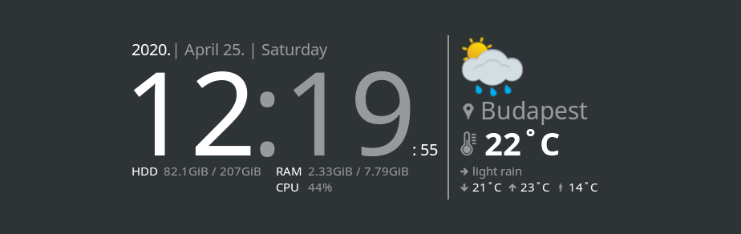

# Conky Widget with Clock and Weather 
This widget uses [openweathermap.org](https://openweathermap.org) API, to get weather information.



## Table of Contents

* [How to install?](#how-to-install)
   * [1. Install conky](#1-install-conky)
      * [On Debian based systems](#on-debian-based-systems)
      * [On CentOS](#on-centos)
      * [On ArchLinux](#on-archlinux)
      * [On SuseLinux](#on-suselinux)
   * [2. Clone repository](#2-clone-repository)
* [First setup](#first-setup)
   * [1. Get API key](#1-get-api-key)
   * [2. Export the API key](#2-export-the-api-key)
   * [3. Change your settings](#3-change-your-settings)
   * [4. Start the widget](#4-start-the-widget)
   * [5. Stop the widget](#5-stop-the-widget)
* [Configuration](#configuration)

## How to install?

### 1. Install conky

#### On Debian based systems

```bash
sudo apt update
sudo apt install conky-all
conky --version
```

[Back to top](#conky-widget-with-clock-and-weather)

#### On CentOS

```bash
sudo yum install -y epel-release
sudo yum install -y conky
```

[Back to top](#conky-widget-with-clock-and-weather)

#### On ArchLinux

```bash
sudo pacman -Sy --noconfirm conky
```

[Back to top](#conky-widget-with-clock-and-weather)

#### On SuseLinux

```bash
sudo zypper -n in conky
```

[Back to top](#conky-widget-with-clock-and-weather)

### 2. Clone repository

```bash
git clone git@github.com:takattila/Clock-With-Weather-Conky.git ~/.conky/Clock-With-Weather-Conky
```

[Back to top](#conky-widget-with-clock-and-weather)

## First setup

### 1. Get API key

- Go to [openweathermap.org/users/sign_up](https://home.openweathermap.org/users/sign_up) and create your account.
- After the registration, you should receive your API key **via e-mail**.

[Back to top](#conky-widget-with-clock-and-weather)

### 2. Export the API key

- Open a terminal, and export your API key, like below:
  ```bash
  export OPENWEATHER_API_KEY=<YOUR-API-KEY>
  ```

[Back to top](#conky-widget-with-clock-and-weather)

### 3. Change your settings

- Edit the [~/.conky/Clock-With-Weather-Conky/settings.lua](settings.lua) file.
- First, you should change the [settings.weather](https://github.com/takattila/Clock-With-Weather-Conky/blob/master/settings.lua#L15) section, as required:
  ```bash
  city = "Budapest",    # Where you are right now?
  language_code = "hu", # Check it here: https://openweathermap.org/current#multi
  lang = "en",          # Check it here: https://openweathermap.org/current#multi
  units = "metric",     # Units: metric, imperial.
  ```

[Back to top](#conky-widget-with-clock-and-weather)

### 4. Start the widget

```bash
~/.conky/Clock-With-Weather-Conky/start.sh
```

[Back to top](#conky-widget-with-clock-and-weather)

### 5. Stop the widget

```bash
~/.conky/Clock-With-Weather-Conky/stop.sh
```

[Back to top](#conky-widget-with-clock-and-weather)

## Configuration

- The [appearance](https://github.com/takattila/Clock-With-Weather-Conky/blob/master/settings.lua#L3-L9) section

- The [system](https://github.com/takattila/Clock-With-Weather-Conky/blob/master/settings.lua#L11-L13) section

- The [weather](https://github.com/takattila/Clock-With-Weather-Conky/blob/master/settings.lua#L15-L22) section

[Back to top](#conky-widget-with-clock-and-weather)
