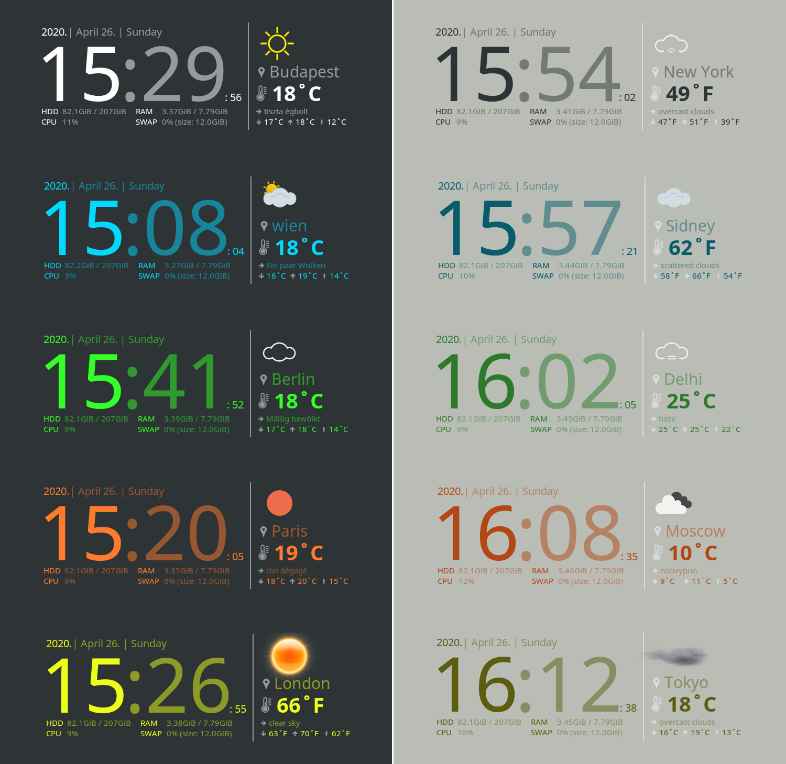
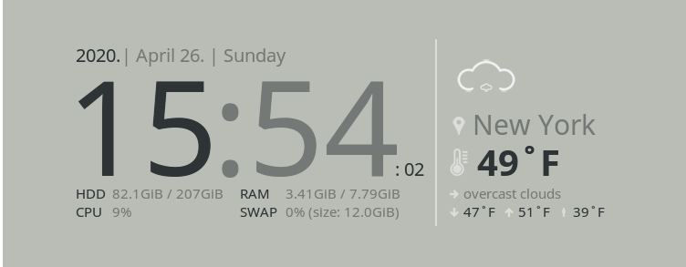
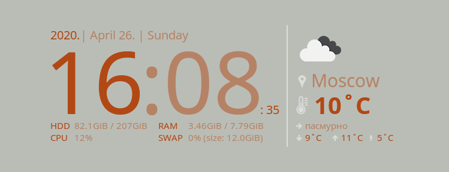
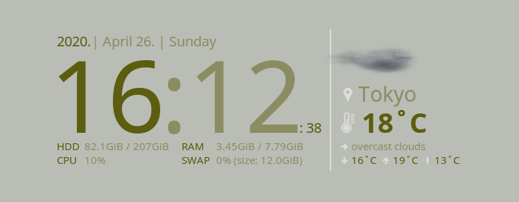

# Conky Widget with Clock and Weather 
This widget uses [openweathermap.org](https://openweathermap.org) API, to get weather information.


## Table of Contents

* [How to install?](#how-to-install)
   * [1. Install conky](#1-install-conky)
      * [On Debian based systems](#on-debian-based-systems)
      * [On CentOS](#on-centos)
      * [On ArchLinux](#on-archlinux)
      * [On SuseLinux](#on-suselinux)
      * [On Mac](#on-mac)
   * [2. Clone repository](#2-clone-repository)
* [First setup](#first-setup)
   * [1. Get API key](#1-get-api-key)
   * [2. Export the API key](#2-export-the-api-key)
   * [3. Change your settings](#3-change-your-settings)
   * [4. Start the widget](#4-start-the-widget)
   * [5. Stop the widget](#5-stop-the-widget)
* [Configuration](#configuration)
   * [The app.cfg](#the-appcfg)
   * [The settings.lua](#the-settingslua)
      * [Sections](#sections)
* [Example Themes](#example-themes)
   * [Budapest](#budapest)
   * [Wien](#wien)
   * [Berlin](#berlin)
   * [Paris](#paris)
   * [London](#london)
   * [New York](#new-york)
   * [Sidney](#sidney)
   * [Delhi](#delhi)
   * [Moscow](#moscow)
   * [Tokyo](#tokyo)

## How to install?

### 1. Install conky

#### On Debian based systems

```bash
sudo apt update
sudo apt install conky-all
conky --version
```

[Back to top](#conky-widget-with-clock-and-weather)

#### On CentOS

```bash
sudo yum install -y epel-release
sudo yum install -y conky
```

[Back to top](#conky-widget-with-clock-and-weather)

#### On ArchLinux

```bash
sudo pacman -Sy --noconfirm conky
```

[Back to top](#conky-widget-with-clock-and-weather)

#### On SuseLinux

```bash
sudo zypper -n in conky
```

[Back to top](#conky-widget-with-clock-and-weather)

#### On Mac

You can find the installation steps on [this page](https://github.com/Conky-for-macOS/conky-for-macOS/wiki/How-to-install).

[Back to top](#conky-widget-with-clock-and-weather)

### 2. Clone repository

```bash
git clone git@github.com:takattila/Clock-With-Weather-Conky.git ~/.conky/Clock-With-Weather-Conky
```

[Back to top](#conky-widget-with-clock-and-weather)

## First setup

### 1. Get API key

- Go to [openweathermap.org/users/sign_up](https://home.openweathermap.org/users/sign_up) and create your account.
- After the registration, you should receive your API key **via e-mail**.

[Back to top](#conky-widget-with-clock-and-weather)

### 2. Export the API key

- Open a terminal, and export your API key, like below:
  ```bash
  export OPENWEATHER_API_KEY=<YOUR-API-KEY>
  ```

[Back to top](#conky-widget-with-clock-and-weather)

### 3. Change your settings

- Edit the [~/.conky/Clock-With-Weather-Conky/settings.lua](settings.lua) file.
- First, you should change the [settings.weather](https://github.com/takattila/Clock-With-Weather-Conky/blob/master/settings.lua#L16) section, as required:
  ```bash
  city = "Budapest",    # Where you are right now?
  language_code = "hu", # Check it here: https://openweathermap.org/current#multi
  lang = "en",          # Check it here: https://openweathermap.org/current#multi
  units = "metric",     # Units: metric, imperial.
  ```

[Back to top](#conky-widget-with-clock-and-weather)

### 4. Start the widget

```bash
~/.conky/Clock-With-Weather-Conky/start.sh
```

[Back to top](#conky-widget-with-clock-and-weather)

### 5. Stop the widget

```bash
~/.conky/Clock-With-Weather-Conky/stop.sh
```

[Back to top](#conky-widget-with-clock-and-weather)

## Configuration

### The app.cfg

Here we can modify the conky window settings:
- [Background](https://github.com/takattila/Clock-With-Weather-Conky/blob/master/app.cfg#L2)
- [Border](https://github.com/takattila/Clock-With-Weather-Conky/blob/master/app.cfg#L34)
- [Size](https://github.com/takattila/Clock-With-Weather-Conky/blob/master/app.cfg#L24-L25)
- [Alignment](https://github.com/takattila/Clock-With-Weather-Conky/blob/master/app.cfg#L27)

### The settings.lua

Here we can change the display settings, such as:
- Text color
- Locale
- Iconset
- Weather settings

#### Sections

- The [appearance](https://github.com/takattila/Clock-With-Weather-Conky/blob/master/settings.lua#L3-L9) section
- The [system](https://github.com/takattila/Clock-With-Weather-Conky/blob/master/settings.lua#L11-L14) section
- The [weather](https://github.com/takattila/Clock-With-Weather-Conky/blob/master/settings.lua#L16-L23) section

[Back to top](#conky-widget-with-clock-and-weather)

## Example Themes



[Back to top](#conky-widget-with-clock-and-weather)

### Budapest


```lua
local settings = {}

settings.appearance = {
    transparency_full = 1.0,
    transparency_half = 0.5,
    transparency_weather_icon = 1.0,
    default_font_face = "Noto Sans",
    html_text_color = "#ffffff",
}

settings.system = {
    locale = "en_US.UTF-8",
    iconset = "dovora",
}

settings.weather = {
    city = "Budapest",
    language_code = "hu",
    lang = "hu",
    units = "metric",
    api_key = os.getenv("OPENWEATHER_API_KEY"),
    api_url = "https://api.openweathermap.org/data/2.5/weather",
}

return settings
```

[Back to top](#conky-widget-with-clock-and-weather)

### Wien


```lua
local settings = {}

settings.appearance = {
    transparency_full = 1.0,
    transparency_half = 0.5,
    transparency_weather_icon = 1.0,
    default_font_face = "Noto Sans",
    html_text_color = "#03d8fe",
}

settings.system = {
    locale = "en_US.UTF-8",
    iconset = "modern",
}

settings.weather = {
    city = "wien",
    language_code = "at",
    lang = "de",
    units = "metric",
    api_key = os.getenv("OPENWEATHER_API_KEY"),
    api_url = "https://api.openweathermap.org/data/2.5/weather",
}

return settings
```

[Back to top](#conky-widget-with-clock-and-weather)

### Berlin


```lua
local settings = {}

settings.appearance = {
    transparency_full = 1.0,
    transparency_half = 0.5,
    transparency_weather_icon = 1.0,
    default_font_face = "Noto Sans",
    html_text_color = "#34ff26",
}

settings.system = {
    locale = "en_US.UTF-8",
    iconset = "monochrome",
}

settings.weather = {
    city = "Berlin",
    language_code = "de",
    lang = "de",
    units = "metric",
    api_key = os.getenv("OPENWEATHER_API_KEY"),
    api_url = "https://api.openweathermap.org/data/2.5/weather",
}

return settings
```

[Back to top](#conky-widget-with-clock-and-weather)

### Paris


```lua
local settings = {}

settings.appearance = {
    transparency_full = 1.0,
    transparency_half = 0.5,
    transparency_weather_icon = 1.0,
    default_font_face = "Noto Sans",
    html_text_color = "#ff7b2c",
}

settings.system = {
    locale = "en_US.UTF-8",
    iconset = "openweathermap",
}

settings.weather = {
    city = "Paris",
    language_code = "fr",
    lang = "fr",
    units = "metric",
    api_key = os.getenv("OPENWEATHER_API_KEY"),
    api_url = "https://api.openweathermap.org/data/2.5/weather",
}

return settings
```

[Back to top](#conky-widget-with-clock-and-weather)

### London


```lua
local settings = {}

settings.appearance = {
    transparency_full = 1.0,
    transparency_half = 0.5,
    transparency_weather_icon = 1.0,
    default_font_face = "Noto Sans",
    html_text_color = "#ecff18",
}

settings.system = {
    locale = "en_US.UTF-8",
    iconset = "vclouds",
}

settings.weather = {
    city = "London",
    language_code = "gb",
    lang = "gb",
    units = "imperial",
    api_key = os.getenv("OPENWEATHER_API_KEY"),
    api_url = "https://api.openweathermap.org/data/2.5/weather",
}

return settings
```

[Back to top](#conky-widget-with-clock-and-weather)

### New York



```lua
local settings = {}

settings.appearance = {
    transparency_full = 1.0,
    transparency_half = 0.5,
    transparency_weather_icon = 1.0,
    default_font_face = "Noto Sans",
    html_text_color = "#2e3436",
}

settings.system = {
    locale = "en_US.UTF-8",
    iconset = "dovora",
}

settings.weather = {
    city = "New York",
    language_code = "us",
    lang = "us",
    units = "imperial",
    api_key = os.getenv("OPENWEATHER_API_KEY"),
    api_url = "https://api.openweathermap.org/data/2.5/weather",
}

return settings
```

[Back to top](#conky-widget-with-clock-and-weather)

### Sidney


```lua
local settings = {}

settings.appearance = {
    transparency_full = 1.0,
    transparency_half = 0.5,
    transparency_weather_icon = 1.0,
    default_font_face = "Noto Sans",
    html_text_color = "#085c6b",
}

settings.system = {
    locale = "en_US.UTF-8",
    iconset = "modern",
}

settings.weather = {
    city = "Sidney",
    language_code = "au",
    lang = "au",
    units = "imperial",
    api_key = os.getenv("OPENWEATHER_API_KEY"),
    api_url = "https://api.openweathermap.org/data/2.5/weather",
}

return settings
```

[Back to top](#conky-widget-with-clock-and-weather)

### Delhi


```lua
local settings = {}

settings.appearance = {
    transparency_full = 1.0,
    transparency_half = 0.5,
    transparency_weather_icon = 1.0,
    default_font_face = "Noto Sans",
    html_text_color = "#2c7a2a",
}

settings.system = {
    locale = "en_US.UTF-8",
    iconset = "monochrome",
}

settings.weather = {
    city = "Delhi",
    language_code = "in",
    lang = "in",
    units = "metric",
    api_key = os.getenv("OPENWEATHER_API_KEY"),
    api_url = "https://api.openweathermap.org/data/2.5/weather",
}

return settings
```

[Back to top](#conky-widget-with-clock-and-weather)

### Moscow



```lua
local settings = {}

settings.appearance = {
    transparency_full = 1.0,
    transparency_half = 0.5,
    transparency_weather_icon = 1.0,
    default_font_face = "Noto Sans",
    html_text_color = "#b24814",
}

settings.system = {
    locale = "en_US.UTF-8",
    iconset = "modern",
}

settings.weather = {
    city = "Moscow",
    language_code = "ru",
    lang = "ru",
    units = "metric",
    api_key = os.getenv("OPENWEATHER_API_KEY"),
    api_url = "https://api.openweathermap.org/data/2.5/weather",
}

return settings
```

[Back to top](#conky-widget-with-clock-and-weather)

### Tokyo



```lua
local settings = {}

settings.appearance = {
    transparency_full = 1.0,
    transparency_half = 0.5,
    transparency_weather_icon = 1.0,
    default_font_face = "Noto Sans",
    html_text_color = "#5c5d0f",
}

settings.system = {
    locale = "en_US.UTF-8",
    iconset = "vclouds",
}

settings.weather = {
    city = "Tokyo",
    language_code = "jp",
    lang = "jp",
    units = "metric",
    api_key = os.getenv("OPENWEATHER_API_KEY"),
    api_url = "https://api.openweathermap.org/data/2.5/weather",
}

return settings
```

[Back to top](#conky-widget-with-clock-and-weather)
