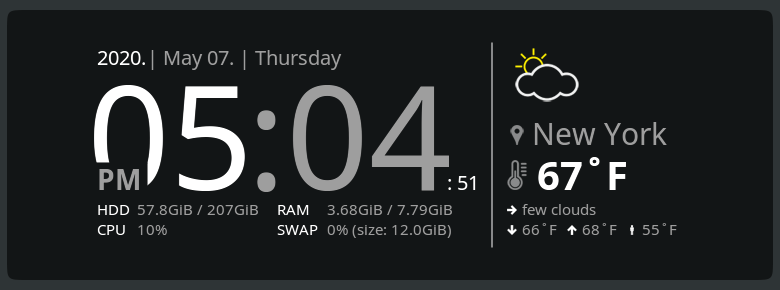
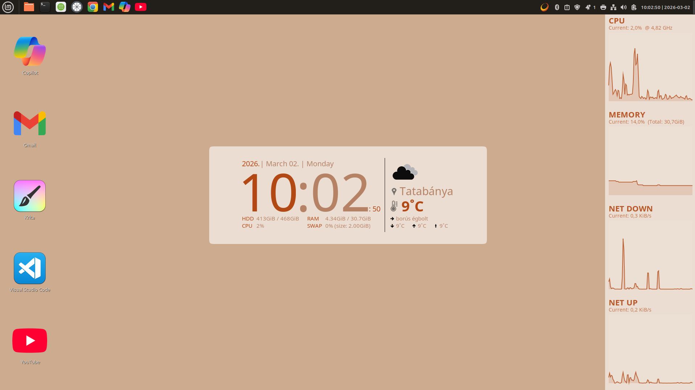

# Conky widget with clock and current weather report

[](https://github.com/takattila/Clock-With-Weather-Conky/releases)
[](https://github.com/takattila/Clock-With-Weather-Conky/wiki)
[](#screenshots)


- This widget uses [openweathermap.org](https://openweathermap.org) API, to get weather information.
- Easy to customize, supports appearance on **light** and **dark** backgrounds. *(See: [Example Themes](./themes/themes.md))*.
- Supports `12` and `24-hour` clock format.
- **System Monitor Panel**: *(See: [Screenshots](#screenshots))*
    - Real-time **CPU** and **Memory** usage charts.
    - **Network Traffic** monitoring (Download/Upload).
    - **Dynamic Scaling**: Network charts automatically adjust their scale and units (KiB/s to MiB/s) based on traffic.
    - **Auto-detection**: Automatically identifies the active network interface (NIC).
- **Multi-monitor Support**: Enhanced geometry detection for specific monitors and automatic workspace area calculation.
- **Desktop Integration**: Automatic creation of Menu icons and optional Desktop shortcuts.

<table>
    <tr>
        <th>
            Dark text with light background
        </th>
        <th>
            Light text with dark background
        </th>
    </tr>
    <tr>
        <td>
            
        </td>
        <td>
            
        </td>
    </tr>
</table>

### How the Widget and Panel Work Together

This Conky widget consists of two separate but perfectly synchronized units designed to provide a unified visual experience:

1.  **Clock & Weather Widget (`cwApp.lua`)**: The core component that displays the time, date, and current weather (temperature, icon, location).
2.  **System Monitor Panel (`panelApp.lua`)**: An optional side panel that sits directly next to the clock. It handles the real-time charts (CPU, Memory, Network).

#### Key Features of the Integration:
*   **Seamless Alignment**: The two components are designed to "snap" together. When the Panel is enabled in the settings, both scripts are launched, and the Panel automatically positions itself adjacent to the clock widget, creating a single, cohesive interface.
*   **Unified Styling**: Both units share the same theme configuration (`appearance.lua`). This ensures that colors, fonts, and transparency levels are perfectly matched, whether you choose a light or dark theme.
*   **Multi-monitor Sync**: The system detects multiple displays and can launch this pair on every monitor, maintaining the same clock-panel layout across your entire workspace.
*   **Visual Hierarchy**: The panel uses alternating "light" and "dark" colors for the charts (e.g., CPU vs. Memory, Download vs. Upload). This intentional design choice provides better visual separation, making it easier to distinguish between different data streams at a glance.


- A list of successful tests can be found [here](TESTS.md).


## Get the OpenWeatherMap API key

- Go to the [openweathermap.org/users/sign_up](https://home.openweathermap.org/users/sign_up) page and create your account.
- After the registration, you should receive your API key **via e-mail**.
- For easier installation, export this API key before running the script below:

  ```bash
  export OPENWEATHER_API_KEY=<YOUR-API-KEY>
  ```

[Back to top](#conky-widget-with-clock-and-current-weather-report)

## Installation

You can install it via the command-line with either `wget` or `curl`:

... via wget:

```bash
bash -c "$(wget --no-check-certificate --no-cache --no-cookies -O- https://raw.githubusercontent.com/takattila/Clock-With-Weather-Conky/master/scripts/install.sh)"
```

... via curl:

```bash
bash -c "$(curl -fsSLk https://raw.githubusercontent.com/takattila/Clock-With-Weather-Conky/master/scripts/install.sh)"
```

[Back to top](#conky-widget-with-clock-and-current-weather-report)

## Start / stop the widget

### 1. Start the widget

```bash
bash ~/.conky/Clock-With-Weather-Conky/scripts/start.sh <YOUR-API-KEY>
```

[Back to top](#conky-widget-with-clock-and-current-weather-report)

### 2. Stop the widget

```bash
bash ~/.conky/Clock-With-Weather-Conky/scripts/stop.sh
```

[Back to top](#conky-widget-with-clock-and-current-weather-report)

## Change settings after installation

```bash
bash ~/.conky/Clock-With-Weather-Conky/scripts/setup.sh
```

Use the above command to **change** the following **settings**:

- city
- country code
- language code
- temperature unit:
  1. metric (for displaying Celsius)
  2. imperial (for displaying Fahrenheit)
- theme number
- hour format (12 or 24)
- window alignment and screen position
- **System Monitor**: toggle the side panel on/off
- **Shortcuts**: enable/disable Desktop icon creation

[Back to top](#conky-widget-with-clock-and-current-weather-report)

## Screenshots

### With panel, theme: light-orange


### With panel, theme: dark-orange-bg



[Back to top](#conky-widget-with-clock-and-current-weather-report)

## Wiki

For detailed documentation, please visit the [wiki](https://github.com/takattila/Clock-With-Weather-Conky/wiki) page.

[Back to top](#conky-widget-with-clock-and-current-weather-report)

## Example Themes

Click [here to see](./themes/themes.md) the available example themes!

[Back to top](#conky-widget-with-clock-and-current-weather-report)
