# Example themes
The available themes are listed bellow.
<br>**Click an item** to see the details!

<details>
<summary>
Weather of <code>berlin</code> city with <code>dark</code> text
</summary>

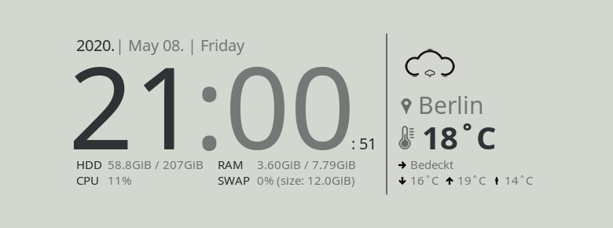

- #### Content of the `themes/weather/berlin/weather.lua` file: [click here](../themes/weather/berlin/weather.lua).

- #### Content of the `themes/appearance/dark/appearance.lua` file: [click here](../themes/appearance/dark/appearance.lua).

- #### Content of the [theme.lua](../theme.lua) file:

  ```lua
  
  local settings = {}
  
  settings = {
      appearance = { 
          name = "dark",
      },
      weather = {
          name = "berlin",
      },
      system = {
          hour_format_12 = true,
          locale = "en_US.UTF-8",
      },
  }
  
  return settings
  ```

[Back to top](#example-themes)

</details>

<details>
<summary>
Weather of <code>budapest</code> city with <code>dark-blue</code> text
</summary>

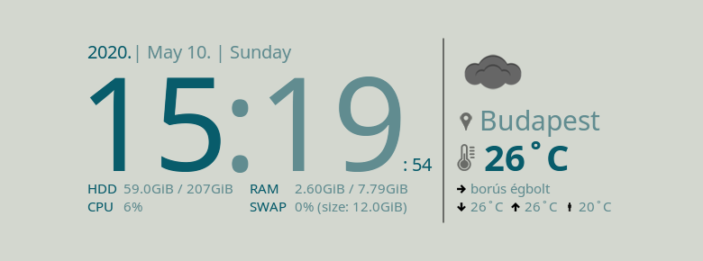

- #### Content of the `themes/weather/budapest/weather.lua` file: [click here](../themes/weather/budapest/weather.lua).

- #### Content of the `themes/appearance/dark-blue/appearance.lua` file: [click here](../themes/appearance/dark-blue/appearance.lua).

- #### Content of the [theme.lua](../theme.lua) file:

  ```lua
  
  local settings = {}
  
  settings = {
      appearance = { 
          name = "dark-blue",
      },
      weather = {
          name = "budapest",
      },
      system = {
          hour_format_12 = true,
          locale = "en_US.UTF-8",
      },
  }
  
  return settings
  ```

[Back to top](#example-themes)

</details>

<details>
<summary>
Weather of <code>delhi</code> city with <code>dark-green</code> text
</summary>

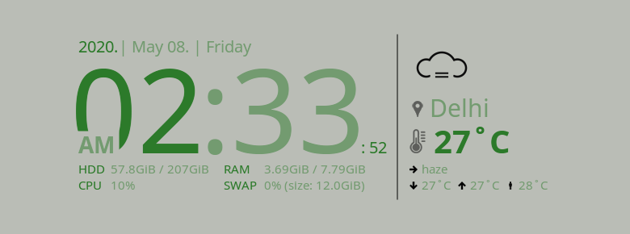

- #### Content of the `themes/weather/delhi/weather.lua` file: [click here](../themes/weather/delhi/weather.lua).

- #### Content of the `themes/appearance/dark-green/appearance.lua` file: [click here](../themes/appearance/dark-green/appearance.lua).

- #### Content of the [theme.lua](../theme.lua) file:

  ```lua
  
  local settings = {}
  
  settings = {
      appearance = { 
          name = "dark-green",
      },
      weather = {
          name = "delhi",
      },
      system = {
          hour_format_12 = true,
          locale = "en_US.UTF-8",
      },
  }
  
  return settings
  ```

[Back to top](#example-themes)

</details>

<details>
<summary>
Weather of <code>london</code> city with <code>dark-orange</code> text
</summary>

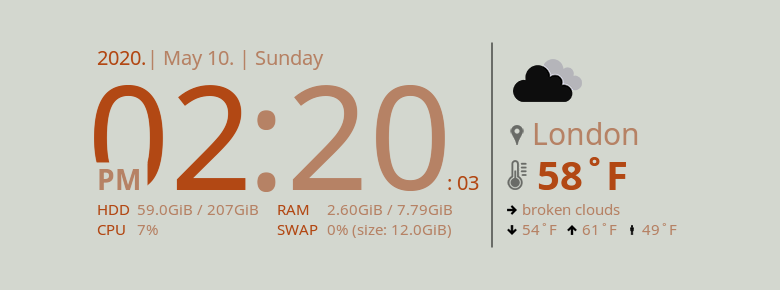

- #### Content of the `themes/weather/london/weather.lua` file: [click here](../themes/weather/london/weather.lua).

- #### Content of the `themes/appearance/dark-orange/appearance.lua` file: [click here](../themes/appearance/dark-orange/appearance.lua).

- #### Content of the [theme.lua](../theme.lua) file:

  ```lua
  
  local settings = {}
  
  settings = {
      appearance = { 
          name = "dark-orange",
      },
      weather = {
          name = "london",
      },
      system = {
          hour_format_12 = true,
          locale = "en_US.UTF-8",
      },
  }
  
  return settings
  ```

[Back to top](#example-themes)

</details>

<details>
<summary>
Weather of <code>moscow</code> city with <code>dark-yellow</code> text
</summary>


- #### Content of the `themes/weather/moscow/weather.lua` file: [click here](../themes/weather/moscow/weather.lua).

- #### Content of the `themes/appearance/dark-yellow/appearance.lua` file: [click here](../themes/appearance/dark-yellow/appearance.lua).

- #### Content of the [theme.lua](../theme.lua) file:

  ```lua
  
  local settings = {}
  
  settings = {
      appearance = { 
          name = "dark-yellow",
      },
      weather = {
          name = "moscow",
      },
      system = {
          hour_format_12 = true,
          locale = "en_US.UTF-8",
      },
  }
  
  return settings
  ```

[Back to top](#example-themes)

</details>

<details>
<summary>
Weather of <code>new-york</code> city with <code>light</code> text
</summary>

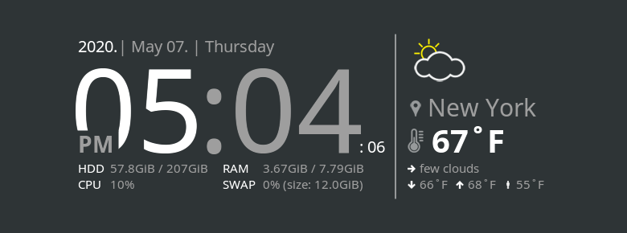

- #### Content of the `themes/weather/new-york/weather.lua` file: [click here](../themes/weather/new-york/weather.lua).

- #### Content of the `themes/appearance/light/appearance.lua` file: [click here](../themes/appearance/light/appearance.lua).

- #### Content of the [theme.lua](../theme.lua) file:

  ```lua
  
  local settings = {}
  
  settings = {
      appearance = { 
          name = "light",
      },
      weather = {
          name = "new-york",
      },
      system = {
          hour_format_12 = true,
          locale = "en_US.UTF-8",
      },
  }
  
  return settings
  ```

[Back to top](#example-themes)

</details>

<details>
<summary>
Weather of <code>paris</code> city with <code>light-blue</code> text
</summary>

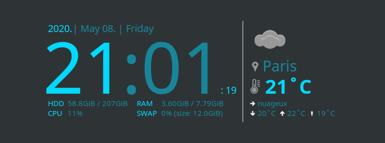

- #### Content of the `themes/weather/paris/weather.lua` file: [click here](../themes/weather/paris/weather.lua).

- #### Content of the `themes/appearance/light-blue/appearance.lua` file: [click here](../themes/appearance/light-blue/appearance.lua).

- #### Content of the [theme.lua](../theme.lua) file:

  ```lua
  
  local settings = {}
  
  settings = {
      appearance = { 
          name = "light-blue",
      },
      weather = {
          name = "paris",
      },
      system = {
          hour_format_12 = true,
          locale = "en_US.UTF-8",
      },
  }
  
  return settings
  ```

[Back to top](#example-themes)

</details>

<details>
<summary>
Weather of <code>sidney</code> city with <code>light-green</code> text
</summary>

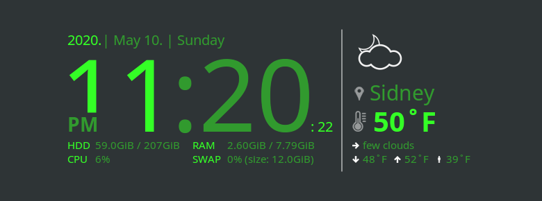

- #### Content of the `themes/weather/sidney/weather.lua` file: [click here](../themes/weather/sidney/weather.lua).

- #### Content of the `themes/appearance/light-green/appearance.lua` file: [click here](../themes/appearance/light-green/appearance.lua).

- #### Content of the [theme.lua](../theme.lua) file:

  ```lua
  
  local settings = {}
  
  settings = {
      appearance = { 
          name = "light-green",
      },
      weather = {
          name = "sidney",
      },
      system = {
          hour_format_12 = true,
          locale = "en_US.UTF-8",
      },
  }
  
  return settings
  ```

[Back to top](#example-themes)

</details>

<details>
<summary>
Weather of <code>tokyo</code> city with <code>light-orange</code> text
</summary>

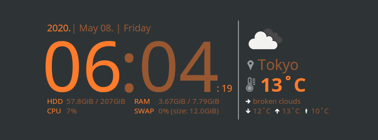

- #### Content of the `themes/weather/tokyo/weather.lua` file: [click here](../themes/weather/tokyo/weather.lua).

- #### Content of the `themes/appearance/light-orange/appearance.lua` file: [click here](../themes/appearance/light-orange/appearance.lua).

- #### Content of the [theme.lua](../theme.lua) file:

  ```lua
  
  local settings = {}
  
  settings = {
      appearance = { 
          name = "light-orange",
      },
      weather = {
          name = "tokyo",
      },
      system = {
          hour_format_12 = true,
          locale = "en_US.UTF-8",
      },
  }
  
  return settings
  ```

[Back to top](#example-themes)

</details>

<details>
<summary>
Weather of <code>wien</code> city with <code>light-yellow</code> text
</summary>


- #### Content of the `themes/weather/wien/weather.lua` file: [click here](../themes/weather/wien/weather.lua).

- #### Content of the `themes/appearance/light-yellow/appearance.lua` file: [click here](../themes/appearance/light-yellow/appearance.lua).

- #### Content of the [theme.lua](../theme.lua) file:

  ```lua
  
  local settings = {}
  
  settings = {
      appearance = { 
          name = "light-yellow",
      },
      weather = {
          name = "wien",
      },
      system = {
          hour_format_12 = true,
          locale = "en_US.UTF-8",
      },
  }
  
  return settings
  ```

[Back to top](#example-themes)

</details>

<details>
<summary>
Weather of <code>berlin</code> city with <code>dark-bg</code> text
</summary>

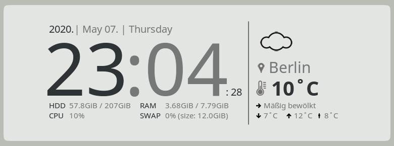

- #### Content of the `themes/weather/berlin/weather.lua` file: [click here](../themes/weather/berlin/weather.lua).

- #### Content of the `themes/appearance/dark-bg/appearance.lua` file: [click here](../themes/appearance/dark-bg/appearance.lua).

- #### Content of the [theme.lua](../theme.lua) file:

  ```lua
  
  local settings = {}
  
  settings = {
      appearance = { 
          name = "dark-bg",
      },
      weather = {
          name = "berlin",
      },
      system = {
          hour_format_12 = true,
          locale = "en_US.UTF-8",
      },
  }
  
  return settings
  ```

[Back to top](#example-themes)

</details>

<details>
<summary>
Weather of <code>budapest</code> city with <code>dark-blue-bg</code> text
</summary>

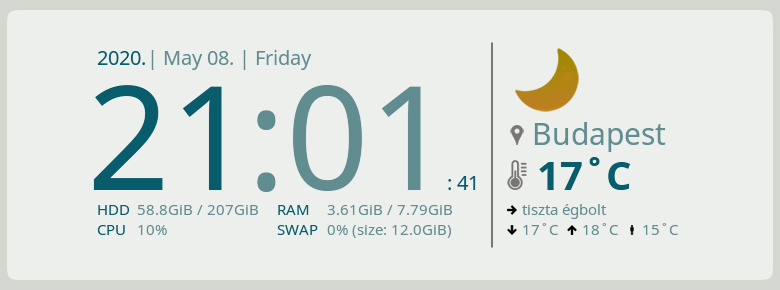

- #### Content of the `themes/weather/budapest/weather.lua` file: [click here](../themes/weather/budapest/weather.lua).

- #### Content of the `themes/appearance/dark-blue-bg/appearance.lua` file: [click here](../themes/appearance/dark-blue-bg/appearance.lua).

- #### Content of the [theme.lua](../theme.lua) file:

  ```lua
  
  local settings = {}
  
  settings = {
      appearance = { 
          name = "dark-blue-bg",
      },
      weather = {
          name = "budapest",
      },
      system = {
          hour_format_12 = true,
          locale = "en_US.UTF-8",
      },
  }
  
  return settings
  ```

[Back to top](#example-themes)

</details>

<details>
<summary>
Weather of <code>delhi</code> city with <code>dark-green-bg</code> text
</summary>

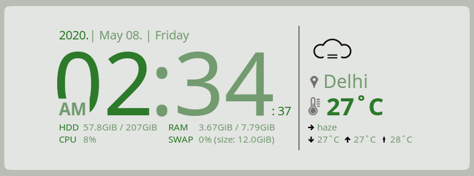

- #### Content of the `themes/weather/delhi/weather.lua` file: [click here](../themes/weather/delhi/weather.lua).

- #### Content of the `themes/appearance/dark-green-bg/appearance.lua` file: [click here](../themes/appearance/dark-green-bg/appearance.lua).

- #### Content of the [theme.lua](../theme.lua) file:

  ```lua
  
  local settings = {}
  
  settings = {
      appearance = { 
          name = "dark-green-bg",
      },
      weather = {
          name = "delhi",
      },
      system = {
          hour_format_12 = true,
          locale = "en_US.UTF-8",
      },
  }
  
  return settings
  ```

[Back to top](#example-themes)

</details>

<details>
<summary>
Weather of <code>london</code> city with <code>dark-orange-bg</code> text
</summary>

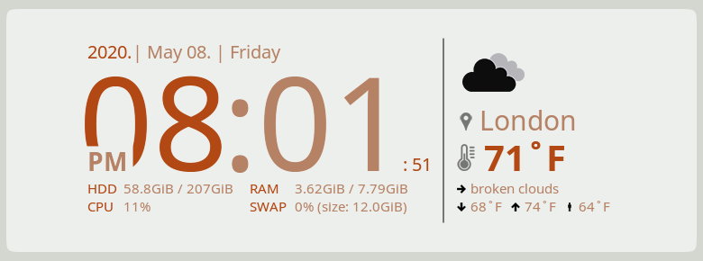

- #### Content of the `themes/weather/london/weather.lua` file: [click here](../themes/weather/london/weather.lua).

- #### Content of the `themes/appearance/dark-orange-bg/appearance.lua` file: [click here](../themes/appearance/dark-orange-bg/appearance.lua).

- #### Content of the [theme.lua](../theme.lua) file:

  ```lua
  
  local settings = {}
  
  settings = {
      appearance = { 
          name = "dark-orange-bg",
      },
      weather = {
          name = "london",
      },
      system = {
          hour_format_12 = true,
          locale = "en_US.UTF-8",
      },
  }
  
  return settings
  ```

[Back to top](#example-themes)

</details>

<details>
<summary>
Weather of <code>moscow</code> city with <code>dark-yellow-bg</code> text
</summary>

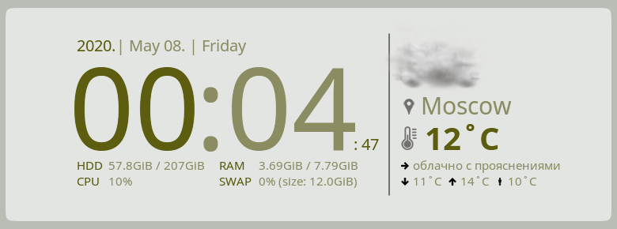

- #### Content of the `themes/weather/moscow/weather.lua` file: [click here](../themes/weather/moscow/weather.lua).

- #### Content of the `themes/appearance/dark-yellow-bg/appearance.lua` file: [click here](../themes/appearance/dark-yellow-bg/appearance.lua).

- #### Content of the [theme.lua](../theme.lua) file:

  ```lua
  
  local settings = {}
  
  settings = {
      appearance = { 
          name = "dark-yellow-bg",
      },
      weather = {
          name = "moscow",
      },
      system = {
          hour_format_12 = true,
          locale = "en_US.UTF-8",
      },
  }
  
  return settings
  ```

[Back to top](#example-themes)

</details>

<details>
<summary>
Weather of <code>new-york</code> city with <code>light-bg</code> text
</summary>

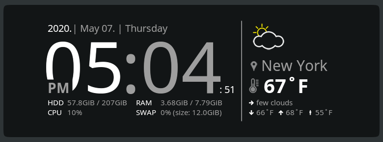

- #### Content of the `themes/weather/new-york/weather.lua` file: [click here](../themes/weather/new-york/weather.lua).

- #### Content of the `themes/appearance/light-bg/appearance.lua` file: [click here](../themes/appearance/light-bg/appearance.lua).

- #### Content of the [theme.lua](../theme.lua) file:

  ```lua
  
  local settings = {}
  
  settings = {
      appearance = { 
          name = "light-bg",
      },
      weather = {
          name = "new-york",
      },
      system = {
          hour_format_12 = true,
          locale = "en_US.UTF-8",
      },
  }
  
  return settings
  ```

[Back to top](#example-themes)

</details>

<details>
<summary>
Weather of <code>paris</code> city with <code>light-blue-bg</code> text
</summary>

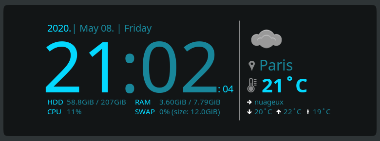

- #### Content of the `themes/weather/paris/weather.lua` file: [click here](../themes/weather/paris/weather.lua).

- #### Content of the `themes/appearance/light-blue-bg/appearance.lua` file: [click here](../themes/appearance/light-blue-bg/appearance.lua).

- #### Content of the [theme.lua](../theme.lua) file:

  ```lua
  
  local settings = {}
  
  settings = {
      appearance = { 
          name = "light-blue-bg",
      },
      weather = {
          name = "paris",
      },
      system = {
          hour_format_12 = true,
          locale = "en_US.UTF-8",
      },
  }
  
  return settings
  ```

[Back to top](#example-themes)

</details>

<details>
<summary>
Weather of <code>sidney</code> city with <code>light-green-bg</code> text
</summary>

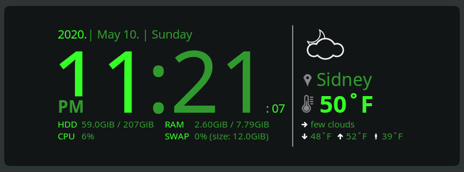

- #### Content of the `themes/weather/sidney/weather.lua` file: [click here](../themes/weather/sidney/weather.lua).

- #### Content of the `themes/appearance/light-green-bg/appearance.lua` file: [click here](../themes/appearance/light-green-bg/appearance.lua).

- #### Content of the [theme.lua](../theme.lua) file:

  ```lua
  
  local settings = {}
  
  settings = {
      appearance = { 
          name = "light-green-bg",
      },
      weather = {
          name = "sidney",
      },
      system = {
          hour_format_12 = true,
          locale = "en_US.UTF-8",
      },
  }
  
  return settings
  ```

[Back to top](#example-themes)

</details>

<details>
<summary>
Weather of <code>tokyo</code> city with <code>light-orange-bg</code> text
</summary>

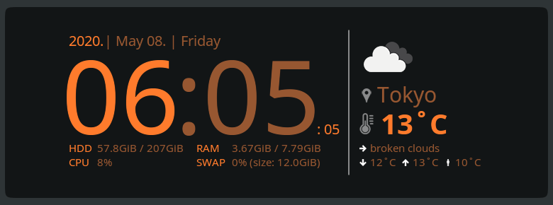

- #### Content of the `themes/weather/tokyo/weather.lua` file: [click here](../themes/weather/tokyo/weather.lua).

- #### Content of the `themes/appearance/light-orange-bg/appearance.lua` file: [click here](../themes/appearance/light-orange-bg/appearance.lua).

- #### Content of the [theme.lua](../theme.lua) file:

  ```lua
  
  local settings = {}
  
  settings = {
      appearance = { 
          name = "light-orange-bg",
      },
      weather = {
          name = "tokyo",
      },
      system = {
          hour_format_12 = true,
          locale = "en_US.UTF-8",
      },
  }
  
  return settings
  ```

[Back to top](#example-themes)

</details>

<details>
<summary>
Weather of <code>wien</code> city with <code>light-yellow-bg</code> text
</summary>

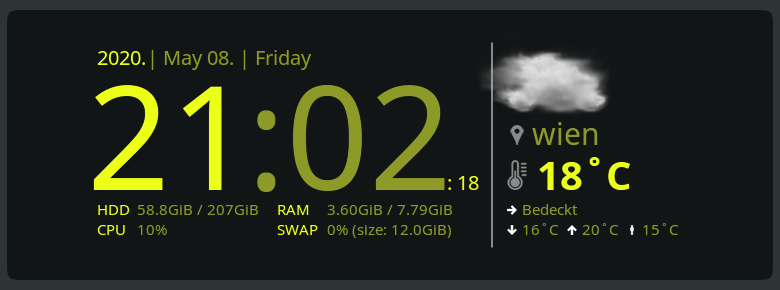

- #### Content of the `themes/weather/wien/weather.lua` file: [click here](../themes/weather/wien/weather.lua).

- #### Content of the `themes/appearance/light-yellow-bg/appearance.lua` file: [click here](../themes/appearance/light-yellow-bg/appearance.lua).

- #### Content of the [theme.lua](../theme.lua) file:

  ```lua
  
  local settings = {}
  
  settings = {
      appearance = { 
          name = "light-yellow-bg",
      },
      weather = {
          name = "wien",
      },
      system = {
          hour_format_12 = true,
          locale = "en_US.UTF-8",
      },
  }
  
  return settings
  ```

[Back to top](#example-themes)

</details>
